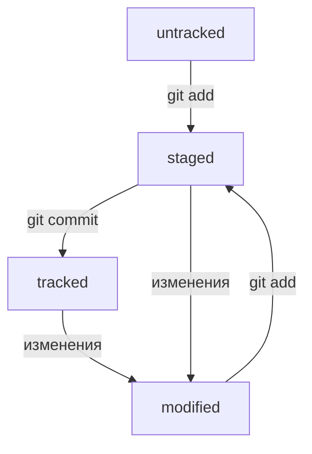

# Основы Git
Этот проект является кратким пересказом части курса по Git на Яндекс Практикуме в качестве выполнения одного из заданий.
## Базовые команды и сокращения
### Перемещение - `cd`
Для перемещения между директориями используется команда `cd`. После неё идёт или название директории лежащей в текущей, или путь в директорию из текущей, или полный путь.
  Также существуют сокращения для названий дерикторий: `..` - родительская директория, `.` - текущая дериктория, `~` - домашняя дериктория.
### Вывести текущую директорию - `pwd`
Тут нечего добавить.
### Вывести содержимое директории `ls`
Чтобы вывести содержимое текущей директории, достаточно ввести команду `ls`, но также можно добавить путь после этой команды, тогда будет выведено содержимое указанной директории.
При этом `.`, `..`, `~` так же поддерживаются.
#### Флаги
**1.** Флаг `-a` позволяет вывести скрытые файлы и директории (например `.`).  
**2.** Так же есть флаг `-la`, который используется в `ls -la .ssh` для вывода списка ключей, но отличие от `-a` не объяснялось.
### Создание директории - `mkdir`
Для создания директории используется команда `mkdir`, далее название директории.
#### Флаги
**1.** Есть один флаг `-p`, при помощи него можно создать несколько вложенных директорий, для этого надо вместо названия директории указать путь с названиями новых директорий.
### Создание файла - `touch`
Для создания файла используется команда `touch`, далее названия файлов через пробел (можно один или несколько).
### Копирование файлов или директорий - `cp`
Чтобы скопировать несколько объектов (можно и один) используется команда `cp`, далее через пробел объекты копирования, а в конце, также через пробел, место куда, копируются объекты.
### Перемещение файлов или директорий - `mv`
Чтобы переместить несколько объектов (можно и один), используется команда `mv`, далее через пробел перемещаемые объекты, а в конце, также через пробел, место, куда перемещаются объекты.
### Чтение текстовых файлов - `cat`
Для того, чтобы вывести содержимое текстового или подобного файла, нужно ввести команду `cat` и название файла.
### Удаление файлов и директорий - `rm`, `rmdir`
**1.** Чтобы удалить пустую директорию достаточно ввести команду `rmdir` и название директории.  
**2.** Чтобы удалить файл нужно использовать команду `rm`, а затем название файла.
#### Флаги `rm`
**1.** Флаг `-r` используется, чтобы удалять непустые директории, но как я выяснил, перед удалением задаются вопросы типа "Точно ли Вы хотите это удалить?", 
на которые не понятно как ответить (нет привычного предложения выбрать между `y` и `n`).  
**2.** Флаг `-rf` лишён "недостатка" флага `-r` и удаляет всё без вопросов.
### Полезные штуки
**1.** Чтобы выполнить несколько команд в одной строчке, надо записать их через `&&` (и пробелы, очевидно).  
**2.** Испоьзуя стрелки вверх и вниз можно быстро вводить команды, запущенные ранее.  
**3.** Используя `Tab` можно попробовать дозаполнить команду файл или директорию, а повторным нажатием узнать варианты, если автозаполнения не произошло.
## `git`
Здесь я опишу команды начинающиеся с `git` (очень интеллектуальное разбиение на теммы). Для краткости я не буду перед каждой командой писать `git`, но это подразумевается (через пробел).
### Инициализация репозитория - `init`
Репозиторий инициализируется один раз, для этого используется команда `init` в директории, которая будет являтся репозиторием.
### Подготовка для коммита - `add`
Чтобы подготовить файлы к коммиту используется команда `add` затем названия файлов или `.`. В последнем случае все файлы в текущей папке подготовятся к коммиту.
#### Флаги
**1.** Есть один флаг: `--all`, при использовании команды с ним все файлы подготавливаются к коммиту (после него не требуются названия файлов).
### Коммит - `commit`
Чтобы сделать коммит, (о чудо) нужно использовать команду `commit`, тогда все подготовленные файлы закоммитятся. Однако без флага `-m` использовать не рекоммендуется.
#### Флаги
**1.** Один, но очень важный флаг - `-m`, после него в кавычках пишется комментарий к коммиту. Без него всё равно попросят написать сообщение, но я не понял как его ввести (возможно, стоило внимательно прочитать, что пишут).
### Инструкция по связи с удалённым репозиторием
Инструкция есть на GitHub в репозитории сразу после его создания.
### Отправка коммитов в удалённый репозиторий - `push`
Команда `push` ничего после себя не требует и отправляет все новые коммиты.
### Посмотреть список коммитов - `log`
Для того, чтобы посмотреть список коммитов нужно использовать `log`. **Важно:** если выход из просмотра коммитов не произошол из-за их количества можно нажать `q`.
#### Флаги
**1.** Для того, чтобы каждый коммит умещался в одну строчку можно использовать флаг `--oneline`.
При этом хеш комита будет минимального размера, чтобы быть уникальным (но, возможно, не меньше 7).
## Статусы файлов
### `untracked`
В `untracked` изначально попадают все файлы, после приминения к файлу `git add` он перестаёт входить в `untracked` на совсем.
### `staged`
После приминения к файлу `git add`, если он был изменён после последнего коммита или вообще не был закоммичен, файл переходит в статус `staged`.
### `modified`
Если файл посли коммита изминить, он попадёт в статус `modified`. Так же такой статус у файлов которые были изменины после нахождения в `staged`.
### `tracked`
Не `untracked`...

## Хеш
### Краткое описание
Хеш хранит информацию о коммите и уникален.
### `HEAD`
`HEAD` - служебный файл в служебной директории `.git`, который хранит ссылку на хеш последнего коммита. Также `HEAD` может использоваться как синоним к хешу последнего коммита.